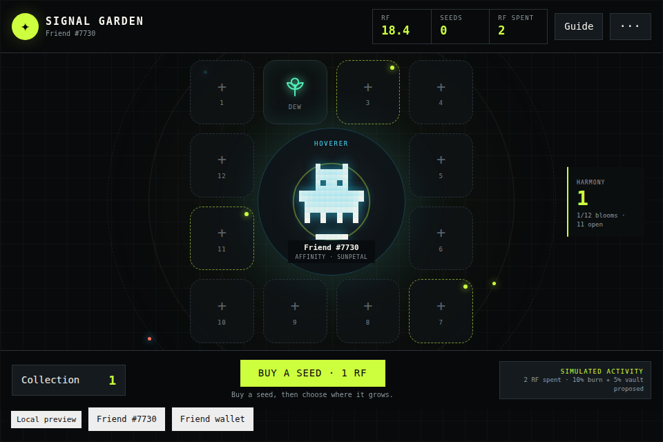

# Signal Garden

Grow a one-of-one signal garden around your verified Rare Friend. Buy a simulated
Signal Seed for 1 RF, choose one of twelve plots, reveal a bloom, then keep it for
harmony or harvest its fixed RF value.

Signal Garden is a FriendSDK v0.1.2 Vibeathon game. The SDK runtime supplies the
wallet connection, owned-Friend picker, fresh eligibility check, sandbox, preview
ledger and action confirmations. The game receives only the verified Friend ID,
the fixed SDK action client and pause state.



## Economy at a glance

The core loop is deliberately easy to audit. The HUD keeps cumulative simulated RF
spend visible even on the 360 px layout, while the activity receipt shows the
corresponding production-model allocation without claiming that a live burn occurred.

| For every 10 simulated Signal Seeds | Amount |
| --- | ---: |
| Gross RF activity | 10 RF |
| Expected harvest liability | 8.5 RF |
| Proposed burn | 1 RF |
| Proposed seasonal vault | 0.5 RF |

Harvesting does not reduce the gross-spend counter. It reopens scarce garden space,
so repeat play increases visible RF activity while every reward remains fixed and
fully described.

## Why the Friend matters

The selected Generations NFT is the center of the experience, not an avatar pasted
over an unrelated game:

- Its canonical on-chain 16×16 animation is read through the SDK sprite reader and
  rendered as the living center of the garden.
- Its on-chain family selects one of four bloom affinities.
- Its on-chain art seed deterministically marks three of the twelve plots as that
  Friend's signal plots.
- Affinity and plot placement affect only non-financial harmony score. They never
  change the disclosed RF odds or rewards.
- Switching Friends creates a visibly and strategically different garden while the
  runtime re-verifies ownership.

## Play

1. Connect a browser wallet on Robinhood mainnet (chain 4663) that owns a hardwired
   Generations NFT, generation 1 or higher.
2. Select a Friend.
3. Choose **Buy a seed · 1 RF** and approve the in-frame simulated action.
4. Choose any empty plot. Planting consumes one seed and reveals one bloom.
5. Keep the bloom for harmony or harvest its fixed simulated RF value.
6. Fill all twelve plots, or harvest blooms to reopen space and continue.

The in-game **Token activity receipt** keeps a running session total of acquired
seeds, signals planted and simulated RF spent. It also calculates the matching
10% burn and 5% season-vault proposal without presenting either as a live transfer.

Mouse, touch and keyboard navigation are supported. All interactive plots and
controls are native buttons with accessible names. Settings include a reduced-motion
mode; the game is silent by design.

## Exact preview economy

All balances, seed purchases, results and harvests are **simulated**. The preview
does not spend RF, request a signature or send a transaction.

| Result | Chance | Fixed harvest value | Base harmony |
| --- | ---: | ---: | ---: |
| Dewbud | 50% / 5,000 bps | 0.4 RF | 1 |
| Sunpetal | 30% / 3,000 bps | 1 RF | 2 |
| Prismvine | 15% / 1,500 bps | 1.5 RF | 4 |
| Starbloom | 5% / 500 bps | 2.5 RF | 8 |

| Rule | Exact value |
| --- | --- |
| Signal Seed | 1 RF (`1000000000000000000` base units) |
| One planting | Consumes exactly one Signal Seed and produces exactly one bloom |
| Expected harvest | 0.85 RF per seed / 85% |
| Maximum harvest | 2.5 RF |
| Backing | Every purchased or pending seed reserves 2.5 RF; kept blooms retain their fixed liability |
| Harvest expiry | None |
| Preview starting balance | 20 simulated RF, supplied by the SDK runtime |
| Persistence | Host ledger lasts for the runtime session; a full reload resets the preview |

The deterministic economy proof is runnable with:

```sh
node games/signal-garden/simulate.mjs
```

It checks that weights total 10,000 bps, expected harvest is exactly 0.85 RF and
the 0.15 RF gap exactly matches the proposed 0.10 RF burn plus 0.05 RF season vault.

### Harmony scoring

Harmony is a session score with no RF value and no effect on outcomes:

- Bloom base value: 1 / 2 / 4 / 8.
- Friend-family affinity match: +3.
- Friend-seed signal plot: +2.
- Affinity bloom on a signal plot: +3 additional harmony.

The score rewards garden composition without making an undisclosed financial claim.

## Proposed production economy

The preview's 85% expected harvest leaves 0.15 RF per 1 RF seed. A reviewed live
version would route that amount transparently:

- **0.10 RF (10%) burned** per planted seed.
- **0.05 RF (5%) sent to a seasonal vault** funding community garden goals and
  fully covered season rewards.
- **0.85 RF expected harvest liability**, with each possible reward fully reserved.

This split is a labeled model, not a live burn or promise. FriendSDK v0.1.2 does
not expose a burn or season-vault action. Any production version needs a separately
reviewed contract, funded reserves, explicit wallet confirmations and auditable
season rules. No live contract or transaction flow is included in this submission.

The model creates three aligned loops:

1. Every planting is RF activity rather than an idle points claim.
2. The burn is proportional and predictable instead of depending on player losses.
3. Kept blooms personalize the Friend, while harvesting returns the published fixed
   value and reopens scarce garden space.

Because the receipt tracks gross seed activity rather than net balance, harvesting
and replanting visibly compounds RF usage instead of erasing the prior loop.

Future seasons can add community layouts, non-redeemable cosmetic habitats backed
by RF spend and opt-in garden exhibitions. Trading, creator fees, persistent saves
and wearable NFTs are not claimed as current SDK capabilities.

## Run locally

Requirements: Linux or Ubuntu/WSL2, Node.js 22+, npm, Git and a browser wallet with
an eligible Generations NFT on Robinhood mainnet.

From the FriendSDK repository root:

```sh
npm ci
npm run build
npm run dev:game -- games/signal-garden
```

Open the printed local URL, normally `http://localhost:4173`.

Build a static preview:

```sh
npx friendsdk build games/signal-garden
```

Upload the complete `games/signal-garden/.friendsdk/` output to an HTTPS static
host. Keep all relative files together. Public previews retain the real wallet and
Friend ownership gate.

## Checks

Run from the FriendSDK repository root:

```sh
npm run build
npx friendsdk check games/signal-garden
node games/signal-garden/simulate.mjs
node games/signal-garden/check.mjs
```

The focused browser check runs the real sandboxed runtime at 960 px and 360 px with
the SDK's read-only test fixture. It verifies:

- wallet/Friend-gated runtime startup and canonical artwork;
- seed purchase and confirmation;
- interrupted settlement recovery without a second seed or play confirmation;
- reveal, keep, plot inspection and harvest;
- token-activity receipt, guide and reduced-motion controls;
- desktop/mobile container bounds and absence of app scaffolding;
- no browser, sandbox or unexpected signing errors.

Mock identity and RPC responses exist only inside the automated test harness. Normal
development and static builds require a real eligible wallet.

## Known limits and safety

- The economy and the proposed burn/vault split are simulated.
- Garden placement is session-local because FriendSDK v0.1.2 has no persistence API.
  If only the sandbox frame reloads, visible plots are rebuilt from host inventory;
  exact prior plot positions are not retained.
- A full runtime reload resets simulated balances and inventory.
- Trading, swaps, creator fees, additional-currency actions, wearables and live
  upgrades are not implemented.
- The game has no signer, arbitrary calldata, private key access, contract deployment
  or bankroll withdrawal capability.
- Official Rare Friends production publication requires separate review.

## Files

| File | Purpose |
| --- | --- |
| `index.tsx` | Game UI, SDK action loop, artwork rendering and recovery behavior |
| `model.ts` | Bloom metadata, Friend-derived signal plots and harmony scoring |
| `style.css` | Responsive desktop/mobile presentation and reduced-motion rules |
| `game.json` | Exact RF price, outcome weights and fixed rewards |
| `simulate.mjs` | Deterministic economy assertions |
| `check.mjs` | Focused end-to-end browser flow at 960 px and 360 px |

## Credits

Built by **raindog_kitetu** — [GitHub @raindogkitetu](https://github.com/raindogkitetu)
and [X @raindog_kitetu](https://x.com/raindog_kitetu).

Built with FriendSDK v0.1.2. Wallet/Friend runtime, canonical Generations artwork,
sandbox bridge and simulated chance-game ledger are from FriendSDK under its
Apache-2.0 source license and artwork notice. Signal Garden's UI, bloom vectors,
rules, scoring and economy model are original. No third-party assets are used.
